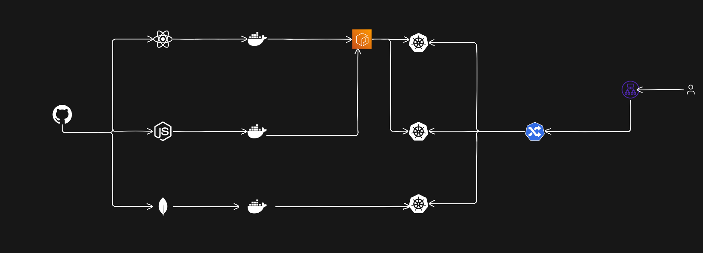

# 🏗️ Architecture

<p align="center">
  
</p>

---

# 🛠️ Tech Stack Used

| Category | Technologies |
|----------|--------------|
| Frontend | React.js, HTML5, CSS3, JavaScript |
| Backend | Node.js, Express.js |
| Database | MongoDB |
| Containerization | Docker |
| Container Registry | Amazon ECR |
| Orchestration | Kubernetes |
| Cloud | AWS (EC2, EKS, ECR, IAM, ALB) |
| DevOps Tools | Git, GitHub, kubectl, eksctl, AWS CLI |
| OS | Ubuntu Linux |


# 📖 About The Project

This project demonstrates the deployment of a **Three-Tier Todo Application** on **Amazon Elastic Kubernetes Service (EKS)** using modern DevOps practices.

The application consists of a **React.js frontend**, **Node.js/Express backend**, and **MongoDB database**. Each component is containerized using Docker and deployed as independent Kubernetes Deployments. Docker images are stored in **Amazon Elastic Container Registry (ECR)**, while Kubernetes manages application scaling, networking, and high availability.

The application is exposed to end users through **Kubernetes Ingress** integrated with the **AWS Load Balancer Controller**, which automatically provisions an **Application Load Balancer (ALB)**.

This project provides hands-on experience with containerization, Kubernetes orchestration, cloud-native deployment, and AWS infrastructure management, making it an ideal DevOps portfolio project.


# Step 1: IAM Configuration

- Create an IAM user with **AdministratorAccess**.
- Generate **Access Key** and **Secret Access Key**.

---

# Step 2: EC2 Setup

- Launch an **Ubuntu EC2 Instance** in your preferred AWS region.
- SSH into the instance.

```bash
ssh -i <key.pem> ubuntu@<EC2-Public-IP>
```

---

# Step 3: Install AWS CLI

```bash
curl "https://awscli.amazonaws.com/awscli-exe-linux-x86_64.zip" -o "awscliv2.zip"

sudo apt update

sudo apt install unzip -y

unzip awscliv2.zip

sudo ./aws/install -i /usr/local/aws-cli -b /usr/local/bin --update

aws configure

aws sts get-caller-identity
```

---

# Step 4: Install Docker

```bash
sudo apt update

sudo apt install docker.io -y

sudo systemctl start docker

sudo systemctl enable docker

sudo usermod -aG docker $USER

newgrp docker

docker version

docker ps
```

---

# Step 5: Install kubectl

```bash
curl -LO "https://dl.k8s.io/release/$(curl -L -s https://dl.k8s.io/release/stable.txt)/bin/linux/amd64/kubectl"

chmod +x kubectl

sudo mv kubectl /usr/local/bin/

kubectl version --client
```

---

# Step 6: Install eksctl

```bash
curl --silent --location "https://github.com/weaveworks/eksctl/releases/latest/download/eksctl_$(uname -s)_amd64.tar.gz" | tar xz -C /tmp

sudo mv /tmp/eksctl /usr/local/bin

eksctl version
```

---

# Step 7: Create Amazon EKS Cluster

```bash
eksctl create cluster \
--name three-tier-cluster \
--region eu-north-1 \
--node-type t3.small \
--nodes 2
```

Configure kubectl

```bash
aws eks update-kubeconfig \
--region eu-north-1 \
--name three-tier-cluster
```

Verify

```bash
kubectl get nodes
kubectl get pods -A
```

---

# Step 8: Build Docker Images

### Frontend

```bash
cd frontend

docker build -t todo-frontend:v1 .
```

### Backend

```bash
cd ../backend

docker build -t todo-backend:v1 .
```

Verify Images

```bash
docker images
```

---

# Step 9: Push Images to Amazon ECR

Authenticate Docker

```bash
aws ecr get-login-password --region eu-north-1 | docker login --username AWS --password-stdin <YOUR_ACCOUNT_ID>.dkr.ecr.eu-north-1.amazonaws.com
```

Tag Images

```bash
docker tag todo-frontend:v1 <YOUR_ECR_URI>/todo-frontend:v1

docker tag todo-backend:v1 <YOUR_ECR_URI>/todo-backend:v1
```

Push Images

```bash
docker push <YOUR_ECR_URI>/todo-frontend:v1

docker push <YOUR_ECR_URI>/todo-backend:v1
```

---

# Step 10: Deploy Kubernetes Manifests

Create Namespace

```bash
kubectl apply -f namespace.yaml
```

Deploy MongoDB

```bash
kubectl apply -f mongodb-deployment.yaml
kubectl apply -f mongodb-service.yaml
```

Deploy Backend

```bash
kubectl apply -f backend-deployment.yaml
kubectl apply -f backend-service.yaml
```

Deploy Frontend

```bash
kubectl apply -f frontend-deployment.yaml
kubectl apply -f frontend-service.yaml
```

Deploy Ingress

```bash
kubectl apply -f ingress.yaml
```

Verify

```bash
kubectl get all -n todo-app

kubectl get ingress -n todo-app
```

---

# Step 11: Install AWS Load Balancer Controller

```bash
curl -O https://raw.githubusercontent.com/kubernetes-sigs/aws-load-balancer-controller/v2.5.4/docs/install/iam_policy.json

aws iam create-policy \
--policy-name AWSLoadBalancerControllerIAMPolicy \
--policy-document file://iam_policy.json
```

Associate OIDC Provider

```bash
eksctl utils associate-iam-oidc-provider \
--region eu-north-1 \
--cluster three-tier-cluster \
--approve
```

Create IAM Service Account

```bash
eksctl create iamserviceaccount \
--cluster three-tier-cluster \
--namespace kube-system \
--name aws-load-balancer-controller \
--role-name AmazonEKSLoadBalancerControllerRole \
--attach-policy-arn arn:aws:iam::<ACCOUNT_ID>:policy/AWSLoadBalancerControllerIAMPolicy \
--approve \
--region eu-north-1
```

Install Controller

```bash
sudo snap install helm --classic

helm repo add eks https://aws.github.io/eks-charts

helm repo update

helm install aws-load-balancer-controller eks/aws-load-balancer-controller \
-n kube-system \
--set clusterName=three-tier-cluster \
--set serviceAccount.create=false \
--set serviceAccount.name=aws-load-balancer-controller
```

Verify

```bash
kubectl get deployment -n kube-system aws-load-balancer-controller
```

---

# Cleanup

Delete Kubernetes Resources

```bash
kubectl delete -f .
```

Delete EKS Cluster

```bash
eksctl delete cluster \
--name three-tier-cluster \
--region eu-north-1
```

To avoid AWS charges:

- Terminate the EC2 instance.
- Delete the Application Load Balancer.
- Delete unused ECR repositories.
- Delete any remaining Security Groups, VPC resources, and Elastic IPs if they are no longer required.
